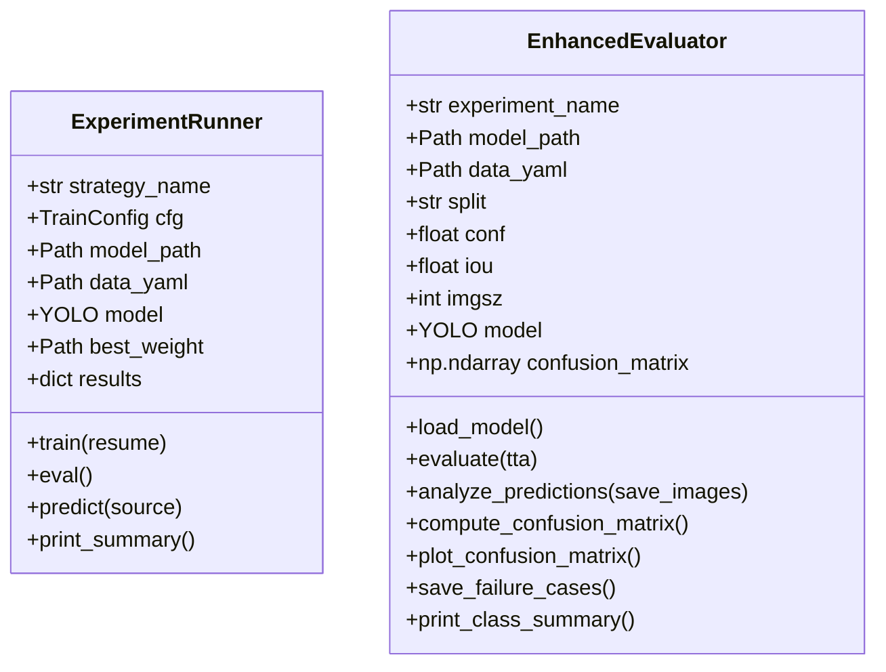

# 算法核心模块类图

```mermaid
classDiagram
    class ExperimentRunner {
        +str strategy_name
        +TrainConfig cfg
        +Path model_path
        +Path data_yaml
        +YOLO model
        +Path best_weight
        +dict results
        +train(resume)
        +eval()
        +predict(source)
        +print_summary()
    }

    class EnhancedEvaluator {
        +str experiment_name
        +Path model_path
        +Path data_yaml
        +str split
        +float conf
        +float iou
        +int imgsz
        +YOLO model
        +np.ndarray confusion_matrix
        +load_model()
        +evaluate(tta)
        +analyze_predictions(save_images)
        +compute_confusion_matrix()
        +plot_confusion_matrix()
        +save_failure_cases()
        +print_class_summary()
    }
```
