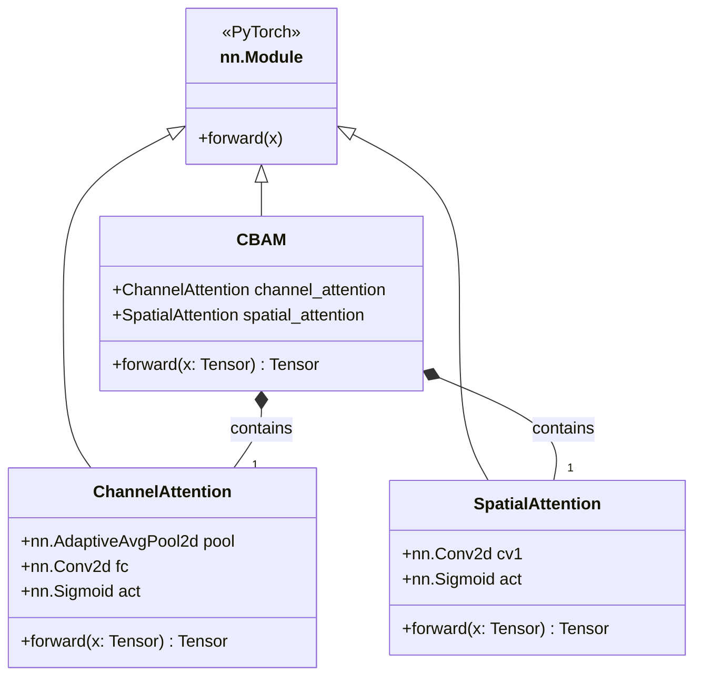
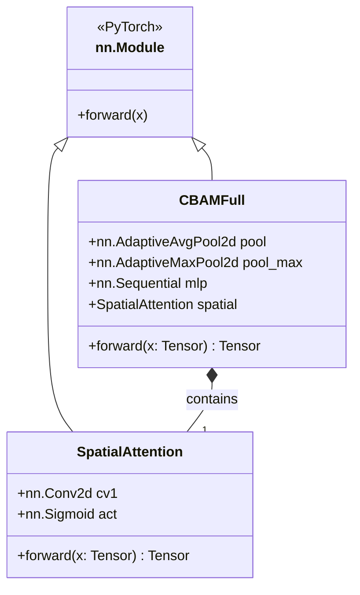

# CBAM 模块类图

## 简化版 CBAM（本文采用）

## 原始论文版 CBAM（对比）

## 说明

- **ChannelAttention**：简化版通道注意力。仅保留全局平均池化（`AdaptiveAvgPool2d`），去除原始论文中的最大池化支路；1×1 卷积直接做 `C→C` 映射，不经过中间降维层。
- **SpatialAttention**：空间注意力。沿通道维度分别执行 `mean` 和 `max` 池化，拼接为 2 通道特征图后，经 7×7 卷积生成空间权重。
- **CBAM**：组合模块。按 **通道注意力 → 空间注意力** 的顺序串行调用，不改变特征图通道数，仅重新加权。
- **CBAMFull**：原始论文实现（消融实验对比用）。通道注意力采用双池化 + 共享 MLP（降维比 r=16）。
