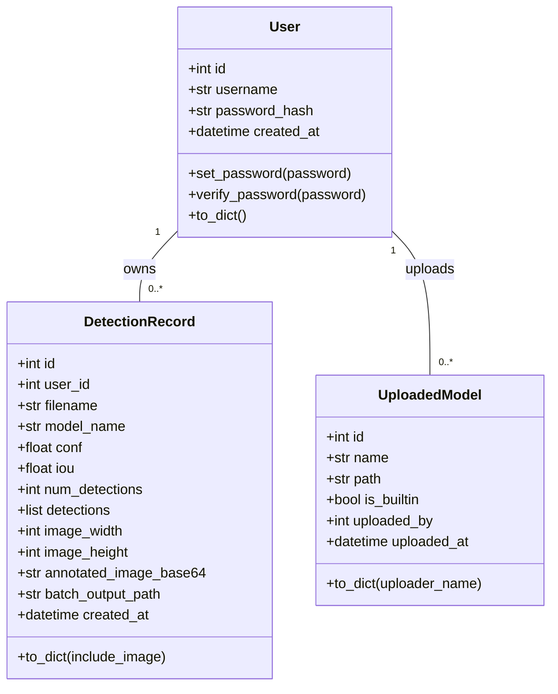

# Webapp 数据模型类图

```mermaid
classDiagram
    class User {
        +int id
        +str username
        +str password_hash
        +datetime created_at
        +set_password(password)
        +verify_password(password)
        +to_dict()
    }

    class DetectionRecord {
        +int id
        +int user_id
        +str filename
        +str model_name
        +float conf
        +float iou
        +int num_detections
        +list detections
        +int image_width
        +int image_height
        +str annotated_image_base64
        +str batch_output_path
        +datetime created_at
        +to_dict(include_image)
    }

    class UploadedModel {
        +int id
        +str name
        +str path
        +bool is_builtin
        +int uploaded_by
        +datetime uploaded_at
        +to_dict(uploader_name)
    }

    User "1" -- "0..*" DetectionRecord : owns
    User "1" -- "0..*" UploadedModel : uploads
```
