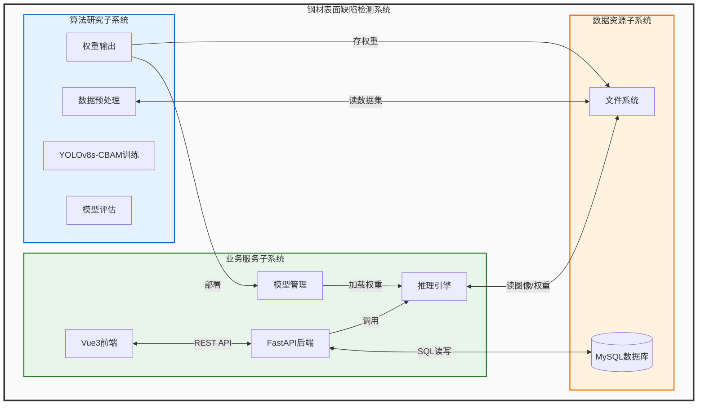

# 系统总体架构（紧凑框图版）

## 架构说明

系统总体架构采用**单一大框内嵌三层子系统**的紧凑框图形式，自左向右划分为算法研究子系统、业务服务子系统、数据资源子系统三大组成部分，各子系统内部包含若干功能模块，模块之间通过带标注箭头表达核心调用与数据流向关系。

**算法研究子系统**负责模型构建与训练优化，包含数据预处理、YOLOv8s-CBAM网络训练、模型评估及权重输出四个模块，最终产出最优检测模型供业务侧部署。

**业务服务子系统**面向用户提供在线检测服务，采用前后端分离架构。Vue3前端负责界面交互；FastAPI后端承载认证、检测、统计等业务逻辑；模型管理模块接收算法侧权重并加载至PyTorch推理引擎；推理引擎接收图像输入，输出缺陷类别、置信度及边界框坐标。

**数据资源子系统**为上层子系统提供持久化支撑，MySQL数据库管理用户信息、检测记录、统计报表等结构化数据；文件系统存储原始图像、增强样本、模型权重及评估报告等非结构化资源。

三个子系统之间通过两条核心链路交互：一是**模型交付链路**，算法子系统输出的最优权重（.pt文件）经部署进入业务子系统的模型管理模块；二是**数据读写链路**，业务子系统通过标准SQL接口读写MySQL，通过文件路径访问文件系统，算法子系统则从文件系统读取数据集并回写训练产物。

## Mermaid 代码

## 与展开式流程图的区别

| 维度 | 紧凑框图版（本版） | 展开式流程图（上一版） |
|------|-------------------|---------------------|
| 表达重点 | **系统由哪些模块组成** | **数据/控制流如何传递** |
| 节点粒度 | 子系统+模块两级 | 每个处理步骤单独成节点 |
| 箭头含义 | 模块间调用/交付关系 | 完整的数据流转过程 |
| 适用场景 | 论文总体架构章节 | 详细设计或流程说明 |
| 图幅大小 | 紧凑，一页可放下 | 较长，可能跨页 |

建议将此紧凑框图作为论文**第3章总体架构**的配图，若后续章节需要展开某一子系统的内部流程，再单独绘制该子系统的详细流程图。
