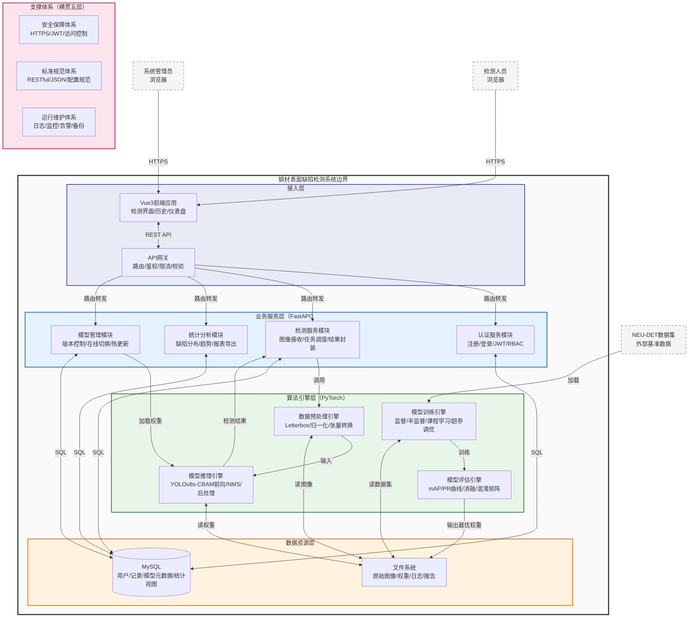

# 系统总体架构（饱满版）

## 架构描述

图3-1展示了钢材表面缺陷检测系统的总体逻辑架构。系统采用分层解耦设计，自顶向下划分为用户层、接入层、业务服务层、算法引擎层和数据资源层五个横向层级；同时在纵向按功能域划分为检测域、管理域和统计域三个业务领域。安全保障体系、标准规范体系与运行维护体系作为三大支撑体系横贯所有层级，为系统提供统一的安全、规范与运维保障。

**用户层**位于系统边界之外，明确标识了系统的两类外部角色：检测人员通过浏览器访问Web前端执行缺陷检测任务；系统管理员通过浏览器进行模型管理、用户权限配置及系统监控。此外，NEU-DET数据集作为外部数据源，为算法引擎层提供基准训练与测试资源。

**接入层**承担内外部交互的桥梁职责。Vue3前端应用基于组件化开发，构建检测操作界面、历史记录浏览及统计仪表盘三大功能视图；API网关模块负责统一入口管理，实现请求路由分发、JWT身份鉴权、参数校验与流量限流，将合法请求转发至下游业务服务。

**业务服务层**基于FastAPI框架构建，按功能域纵向划分为四个核心模块：认证服务模块实现用户注册、登录及RBAC权限控制；检测服务模块接收图像上传请求，调度算法引擎执行推理，并将结果封装返回；统计分析模块聚合检测记录，生成缺陷分布、时序趋势及多维度报表；模型管理模块负责模型权重版本控制、在线切换及配置热更新。

**算法引擎层**是系统的技术核心，包含四个专用引擎：数据预处理引擎完成图像尺寸归一化（Letterbox）、像素归一化及张量格式转换；模型推理引擎基于PyTorch加载YOLOv8s-CBAM-GFPN权重，执行前向计算、NMS非极大值抑制及后处理，输出缺陷类别、置信度与边界框坐标；模型训练引擎支持监督学习、半监督学习（FixMatch/伪标签/课程学习）及超参数自适应调优；模型评估引擎计算mAP@0.5、mAP@0.5:0.95指标，生成PR曲线、混淆矩阵及消融实验报告。

**数据资源层**采用关系型数据库与文件系统混合存储策略。MySQL数据库管理用户账户、检测记录、模型元数据及统计视图等结构化数据；文件系统存储原始钢材图像、增强后样本、模型权重文件（.pt）、训练日志及评估报告等非结构化资源。

**支撑体系**横贯上述五层：安全保障体系通过HTTPS传输加密、JWT令牌校验及接口访问控制实现端到端安全防护；标准规范体系统一数据交换格式（JSON）、接口协议（RESTful）及模型配置规范；运行维护体系集成日志采集、异常告警、性能监控及定时备份机制，保障系统长期稳定运行。

各层之间通过标准接口交互：用户层经HTTPS访问接入层；接入层经RESTful API调用业务服务层；检测服务经内部接口调用算法引擎层；算法引擎层与业务服务层统一通过SQL与文件I/O访问数据资源层。层间单向依赖，禁止跨层直接调用，实现了表示逻辑、业务逻辑、算法逻辑与数据存储的完全解耦。

## Mermaid 代码

## 绘图建议

Mermaid 渲染复杂架构图时存在自动布局限制，若对图幅比例或节点对齐有严格要求，建议采用以下方式精修：

1. **先用 Mermaid 定结构**：用上述代码快速确定模块划分与层级关系，确保逻辑无遗漏。
2. **再迁移到 Visio / ProcessOn / PPT**：将 Mermaid 渲染结果截图作为底图，在 Visio 或 PowerPoint 中重新绘制，可精确控制：
   - 节点大小一致、对齐网格
   - 外部实体（用户/数据集）用**虚线框**或**灰色填充**与系统内部模块区分
   - 支撑体系用**横跨底部的横条**或**两侧竖条**表示，增强"横贯全局"的视觉隐喻
   - 同层节点使用同一色系（接入层=蓝紫、业务层=蓝色、算法层=绿色、数据层=橙色、支撑=玫红）
3. **导出与插入**：在 Visio/PPT 中导出为 **EMF 或 300dpi PNG**，插入 Word 后放大仍清晰。

## 模块与论文章节对照

| 层级 | 模块 | 论文对应章节 | 实现文件/目录 |
|------|------|-------------|--------------|
| 接入层 | Vue3前端 | 第3章 系统实现 | `src/webapp/frontend` |
| 接入层 | API网关 | 第3章 系统实现 | `src/webapp/app.py` |
| 业务层 | 认证服务 | 第3章 系统实现 | `src/webapp/auth.py` |
| 业务层 | 检测服务 | 第3章 系统实现 | `src/webapp/detection.py` |
| 业务层 | 统计分析 | 第3章 系统实现 | `src/webapp/statistics.py` |
| 业务层 | 模型管理 | 第3章 系统实现 | `src/webapp/model_manager.py` |
| 算法层 | 数据预处理 | 第3章  baseline / 第4章实验 | `ultralytics-main/ultralytics/data` |
| 算法层 | 模型推理 | 第3章 推理服务 | `src/utils/evaluator.py` |
| 算法层 | 模型训练 | 第3章 训练策略 | `train.py`, `src/utils/trainer.py` |
| 算法层 | 模型评估 | 第4章 实验评估 | `evaluate.py`, `src/utils/evaluation.py` |
| 数据层 | MySQL | 第3章 数据库设计 | `src/webapp/database.py` |
| 数据层 | 文件系统 | 第3章 系统实现 | `data/`, `experiments/`, `runs/` |
