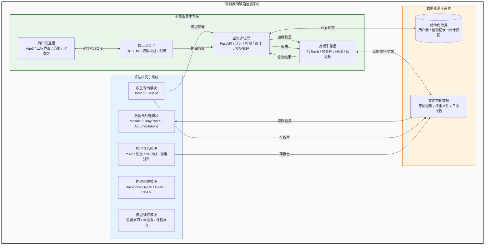

# 系统总体架构（丰富框图版）

## 架构说明

系统总体架构采用**单一大框嵌套三个子系统、每个子系统内含五至六个功能模块**的层次化框图形式。整体自左向右划分为算法研究子系统、业务服务子系统、数据资源子系统，各模块通过带标注箭头表达数据流、控制流与部署关系。

**算法研究子系统**聚焦模型构建与训练优化，由五个纵向模块组成：数据预处理模块负责Mosaic、CopyPaste、Albumentations等增强及数据集划分；网络构建模块封装CSPDarknet主干、GFPN特征融合 neck、多尺度检测头及CBAM注意力机制；模型训练模块支持监督学习、半监督学习（FixMatch/伪标签/课程学习）及超参数配置；模型评估模块完成mAP计算、消融实验、PR曲线绘制及混淆矩阵生成；权重导出模块输出最优权重（best.pt）与末次权重（last.pt）。

**业务服务子系统**采用四层纵向架构：用户交互层基于Vue3实现图像上传界面、历史记录浏览及统计仪表盘可视化；接口网关层承担RESTful路由转发、权限校验与限流保护；业务逻辑层基于FastAPI构建，划分认证、检测、统计分析、模型管理四大功能模块；推理引擎层基于PyTorch实现图像预处理、模型前向计算、NMS非极大值抑制及后处理，最终输出缺陷类别、置信度与边界框坐标。

**数据资源子系统**采用双轨存储：结构化数据轨由MySQL承载，包含用户表、检测记录表、模型元数据表及统计视图；非结构化数据轨由文件系统承载，存储原始图像、增强样本、模型权重文件、训练日志及评估报告。上层子系统通过SQL接口与文件路径分别访问两类存储。

子系统间存在三条核心链路：一是**模型交付链路**，算法子系统的权重导出模块将best.pt部署至业务子系统的模型管理模块，再加载至推理引擎；二是**检测请求链路**，用户交互层经接口网关到达业务逻辑层，由检测模块调度推理引擎，结果经原路返回并写入数据层；三是**数据支撑链路**，算法子系统从文件系统读取数据集，回写权重与报告，业务子系统读写数据库及文件系统。

## Mermaid 代码

## 模块清单

| 子系统 | 模块 | 职责说明 |
|--------|------|----------|
| 算法研究 | 数据预处理 | Mosaic、CopyPaste、Albumentations增强，训练/验证/测试集划分 |
| 算法研究 | 网络构建 | CSPDarknet主干、GFPN特征融合、多尺度检测头、CBAM注意力插入 |
| 算法研究 | 模型训练 | 监督学习策略、半监督学习（FixMatch/伪标签/课程学习）、超参数调优 |
| 算法研究 | 模型评估 | mAP@0.5、mAP@0.5:0.95、消融实验、PR曲线、混淆矩阵 |
| 算法研究 | 权重导出 | 保存最优权重（best.pt）与末次权重（last.pt），输出评估报告 |
| 业务服务 | 用户交互层 | Vue3前端：图像上传组件、历史记录列表、统计仪表盘（ECharts） |
| 业务服务 | 接口网关层 | 统一入口：路由分发、JWT认证校验、请求限流、参数校验 |
| 业务服务 | 业务逻辑层 | FastAPI：认证模块、检测接口、统计分析API、模型管理（版本切换） |
| 业务服务 | 推理引擎层 | PyTorch：图像预处理（letterbox/归一化）、模型推理、NMS、后处理 |
| 数据资源 | 结构化数据 | MySQL：user表、detection_record表、model_meta表、统计聚合视图 |
| 数据资源 | 非结构化数据 | 文件系统：原始图像、增强后图像、.pt权重、训练日志、PDF/PNG报告 |
