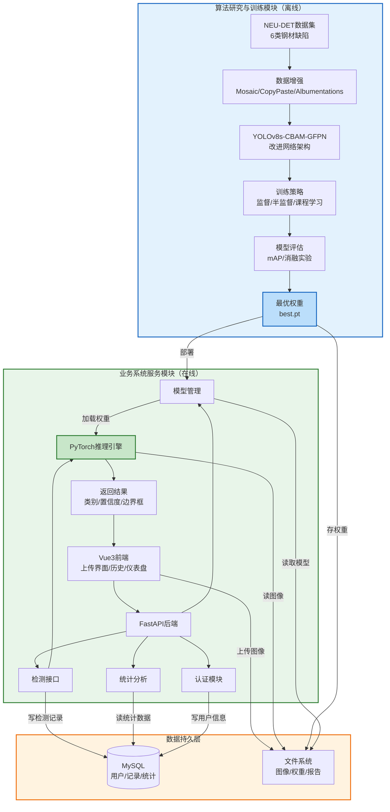

# 系统总体架构

## 架构描述

系统总体架构采用"算法研究-模型交付-业务服务"双主线闭环设计，自左向右划分为算法研究与训练模块、模型交付链路、业务系统服务模块三大组成部分，底层由统一的数据持久层提供资源支撑。

**算法研究与训练模块**（离线实验侧）以NEU-DET数据集为输入，经数据增强与预处理后，送入改进后的YOLOv8s-CBAM-GFPN网络。该模块涵盖监督学习、半监督学习（FixMatch/伪标签/课程学习）等多种训练策略，通过消融实验与模型评估迭代优化，最终产出最优检测模型权重（.pt文件）。

**模型交付链路**承担算法模块与业务模块的桥接职能，最优权重通过模型管理子系统注册、版本化，并加载至后端推理引擎，完成从实验环境到生产服务的部署转换。

**业务系统服务模块**（在线服务侧）采用前后端分离架构。Vue3前端提供检测操作界面、历史记录浏览及统计仪表盘；FastAPI后端划分认证、检测、统计分析、模型管理四大子模块。检测接口接收用户上传的钢材表面图像后，调用PyTorch推理引擎执行前向计算，返回缺陷类别、置信度及边界框坐标，并将结构化结果写入数据库。

**数据持久层**采用关系型数据库与文件系统混合方案：MySQL管理用户信息、检测记录、模型元数据等结构化数据；文件系统存储原始图像、增强样本及模型权重等大容量非结构化资源。各层之间通过标准RESTful接口与文件路径交互，实现了用户界面、业务逻辑、算法推理与数据存储的完全解耦。

## Mermaid 代码

