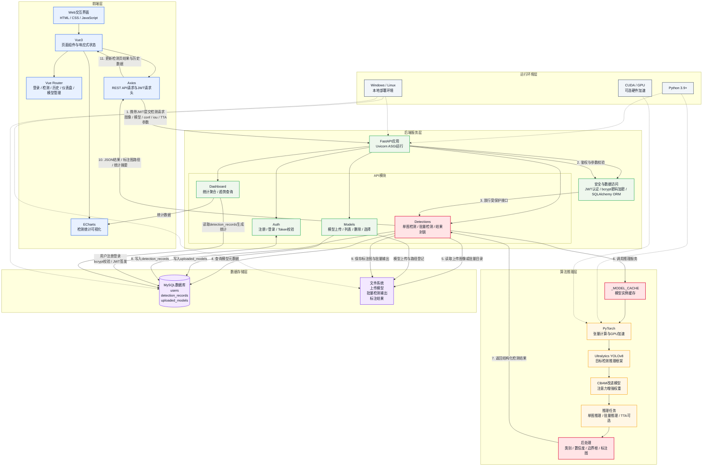

## 5.0 缺陷检测系统技术栈架构图

为说明系统实现阶段各技术组件之间的协作关系，本文将缺陷检测系统划分为前端层、后端服务层、算法推理层、数据存储层和运行环境层五个层级。各层并非简单的软件清单，而是围绕“用户发起检测请求、后端调度模型推理、结果持久化并返回前端展示”的主业务链路组织，如图5-X所示。

**图5-X 缺陷检测系统技术栈架构图**

从主调用链路看，前端检测页通过 Axios 将用户上传的图像、模型选择和阈值参数提交至 FastAPI 后端。后端首先基于 JWT 完成身份校验，再由 Detections 模块查询模型元数据、读取输入文件并调用算法推理层。算法推理层通过 `_MODEL_CACHE` 复用已加载的 PyTorch/YOLOv8-CBAM 模型实例，完成单图或批量推理；若用户启用 TTA，则在推理阶段进行多尺度或翻转增强并融合预测结果。推理完成后，后处理模块生成缺陷类别、置信度、边界框坐标和标注图，后端将结构化结果写入 `detection_records` 表，将标注图或批量检测输出保存至文件系统，最后把 JSON 结果和资源路径返回前端展示。

