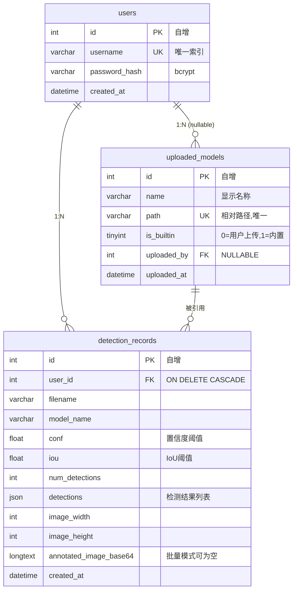
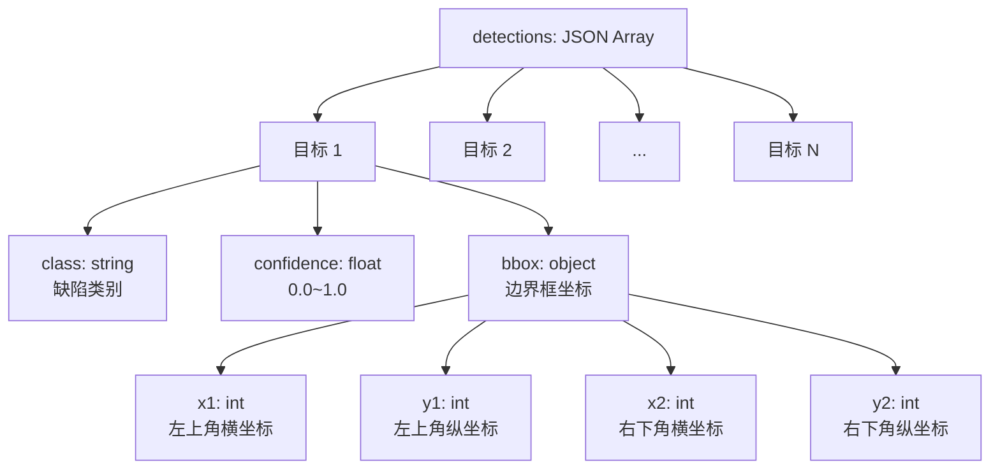

### 5.3 数据库详细设计

系统采用 MySQL 8.0 作为持久化存储，通过 SQLAlchemy ORM 进行对象关系映射。数据库共包含三张核心表：用户表（`users`）、检测记录表（`detection_records`）和模型表（`uploaded_models`）。本节从表结构定义、索引策略、约束关系及 JSON 字段设计四个维度展开详细说明。

#### 5.3.1 表结构定义与数据字典

**（1）用户表（`users`）**

存储系统注册用户的基本信息，采用 bcrypt 算法对密码进行单向哈希。

| 字段名 | 数据类型 | 约束 | 默认值 | 说明 |
|--------|----------|------|--------|------|
| `id` | `INT` | `PRIMARY KEY`, `AUTO_INCREMENT` | — | 用户唯一标识 |
| `username` | `VARCHAR(64)` | `NOT NULL`, `UNIQUE` | — | 登录用户名 |
| `password_hash` | `VARCHAR(255)` | `NOT NULL` | — | bcrypt 哈希后的密码 |
| `created_at` | `DATETIME` | `NOT NULL` | `CURRENT_TIMESTAMP` | 注册时间 |

**（2）检测记录表（`detection_records`）**

存储每次缺陷检测的完整结果，是系统中数据量最大的表。`detections` 字段采用 JSON 类型存储结构化检测结果，`annotated_image_base64` 在批量检测模式下置空以节省存储空间。

| 字段名 | 数据类型 | 约束 | 默认值 | 说明 |
|--------|----------|------|--------|------|
| `id` | `INT` | `PRIMARY KEY`, `AUTO_INCREMENT` | — | 记录唯一标识 |
| `user_id` | `INT` | `NOT NULL`, `FOREIGN KEY` | — | 关联 `users.id` |
| `filename` | `VARCHAR(255)` | `NOT NULL` | — | 原始上传文件名 |
| `model_name` | `VARCHAR(128)` | `NOT NULL` | — | 使用的模型名称 |
| `conf` | `FLOAT` | `NOT NULL` | — | 置信度阈值（如 0.25）|
| `iou` | `FLOAT` | `NOT NULL` | — | IoU 阈值（如 0.45）|
| `num_detections` | `INT` | `NOT NULL` | `0` | 检测到的缺陷数量 |
| `detections` | `JSON` | `NOT NULL` | — | 检测结果列表，结构见 5.3.3 |
| `image_width` | `INT` | `NOT NULL` | — | 原始图像宽度（像素）|
| `image_height` | `INT` | `NOT NULL` | — | 原始图像高度（像素）|
| `annotated_image_base64` | `LONGTEXT` | `NULL` | `NULL` | 标注后图像的 Base64 编码 |
| `created_at` | `DATETIME` | `NOT NULL` | `CURRENT_TIMESTAMP` | 检测完成时间 |

**（3）模型表（`uploaded_models`）**

存储模型权重文件的元数据，区分内置模型与用户上传模型。内置模型的 `uploaded_by` 字段为空。

| 字段名 | 数据类型 | 约束 | 默认值 | 说明 |
|--------|----------|------|--------|------|
| `id` | `INT` | `PRIMARY KEY`, `AUTO_INCREMENT` | — | 模型唯一标识 |
| `name` | `VARCHAR(128)` | `NOT NULL` | — | 模型显示名称 |
| `path` | `VARCHAR(255)` | `NOT NULL`, `UNIQUE` | — | 权重文件相对路径 |
| `is_builtin` | `TINYINT` | `NOT NULL` | `0` | 0=用户上传，1=内置模型 |
| `uploaded_by` | `INT` | `NULL`, `FOREIGN KEY` | `NULL` | 关联 `users.id`，内置模型为空 |
| `uploaded_at` | `DATETIME` | `NOT NULL` | `CURRENT_TIMESTAMP` | 上传时间 |

#### 5.3.2 实体关系与索引设计

**实体关系图**



**索引设计说明**

| 表名 | 索引名称 | 索引字段 | 索引类型 | 设计理由 |
|------|----------|----------|----------|----------|
| `users` | `PRIMARY` | `id` | 聚簇索引 | 主键查询、关联查询 |
| `users` | `idx_username` | `username` | 唯一索引 | 登录时快速定位用户，保证用户名唯一 |
| `detection_records` | `PRIMARY` | `id` | 聚簇索引 | 主键查询 |
| `detection_records` | `idx_user_id` | `user_id` | 普通索引 | 用户查询个人检测记录 |
| `detection_records` | `idx_created_at` | `created_at` | 普通索引 | 按时间范围筛选、倒序排列 |
| `uploaded_models` | `PRIMARY` | `id` | 聚簇索引 | 主键查询 |
| `uploaded_models` | `idx_path` | `path` | 唯一索引 | 防止重复文件，快速加载模型权重 |

**外键约束与级联策略**

| 子表 | 外键字段 | 父表 | 父字段 | 级联策略 | 说明 |
|------|----------|------|--------|----------|------|
| `detection_records` | `user_id` | `users` | `id` | `ON DELETE CASCADE` | 删除用户时级联删除其检测记录 |
| `uploaded_models` | `uploaded_by` | `users` | `id` | `ON DELETE SET NULL` | 删除用户时，其上传模型变为无归属（内置模型不受影响）|

#### 5.3.3 JSON 字段结构设计

`detection_records.detections` 字段存储模型推理得到的缺陷检测结果列表，采用 JSON 数组格式。每个数组元素代表一个检测到的缺陷目标，包含类别标签、置信度分数和边界框坐标。

**JSON Schema 结构图**



**JSON 示例**

```json
[
  {
    "class": " crazing",
    "confidence": 0.9241,
    "bbox": {
      "x1": 120,
      "y1": 85,
      "x2": 340,
      "y2": 210
    }
  },
  {
    "class": "inclusion",
    "confidence": 0.8715,
    "bbox": {
      "x1": 450,
      "y1": 320,
      "x2": 580,
      "y2": 410
    }
  }
]
```

选用 JSON 类型而非独立子表的原因在于：检测结果为一次写入、无需修改的只读数据，且每个记录的检测目标数量不固定。使用 JSON 避免了动态建表的复杂度，同时利用 MySQL 8 的原生 JSON 函数（如 `JSON_CONTAINS`、`JSON_EXTRACT`）可高效完成按类别筛选等查询操作。

#### 5.3.4 存储空间优化策略

检测记录表可能产生大量数据， particularly 标注图像的 Base64 编码会显著增加单条记录体积。因此采取以下优化措施：

1. **批量模式置空策略**：在批量检测场景下，`annotated_image_base64` 字段显式置为 `NULL`，仅在前端需要即时展示单张结果时才存储 Base64 数据。
2. **冷热数据分离**：可按期（如每月）将历史 `detection_records` 数据归档至压缩表或对象存储，生产库仅保留近期数据。
3. **JSON 字段精简**：`detections` 仅保留必要的推理输出字段，不存储冗余的模型中间特征。
