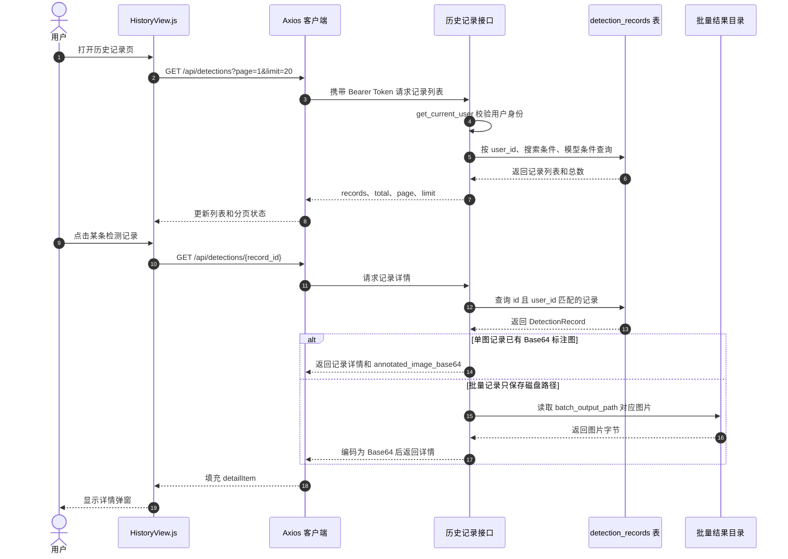

## 5.4 历史记录模块实现

历史记录模块用于保存和展示用户每次缺陷检测产生的结果。它不是一个独立于检测流程之外的手动保存功能，而是在单图检测或批量检测完成后，由后端自动写入检测记录表。用户进入历史记录页后，可以查看自己过去上传过的图片、使用的模型、检测时间、图片尺寸和缺陷数量，并通过详情弹窗查看标注图和具体检测框信息。图 5-X 为历史记录详情弹窗效果，图 5-X 为历史记录模块的类图。

从图 5-X 的页面效果可以看出，历史记录页的重点是“按记录回看检测结果”。列表区域展示检测记录摘要，用户点击某条记录后，页面通过弹窗展示该记录的完整信息。弹窗顶部显示文件名、模型名称和检测时间，中部展示带检测框的标注图，下方展示图片尺寸、检测数量、置信度阈值以及缺陷列表。以图中的 `scratches_5.jpg` 为例，系统在详情中展示了 `scratches` 类缺陷、边界框坐标和 70.0% 的置信度，使用户能够从历史记录中重新定位当时的检测结果。

图 5-X 中的 `HistoryService` 可以理解为历史记录查询和管理逻辑的抽象，在实际代码中主要由 `src/webapp/api/detections.py` 中的历史查询接口实现。该路由模块同时承担检测与历史记录功能：`POST /api/detections/predict` 和 `POST /api/detections/batch` 负责生成检测结果并写入记录；`GET /api/detections` 负责分页查询记录列表；`GET /api/detections/{record_id}` 负责读取单条记录详情；`DELETE /api/detections/clear` 用于清空当前用户的历史记录。这样设计可以让检测结果写入和历史查询使用同一个数据模型，避免在检测模块和历史模块之间重复定义记录结构。

`DetectionRecord` 是历史记录模块的核心数据实体，对应数据库中的 `detection_records` 表，代码位置为 `src/webapp/models/detection_record.py`。该类保存记录编号、用户 ID、文件名、模型名称、置信度阈值、IoU 阈值、检测数量、检测结果、图像宽高、标注图和创建时间等字段。其中，`user_id` 通过外键关联用户表，用于区分不同用户的数据；`detections` 字段以 JSON 形式保存检测框列表，每个检测框包含类别编号、类别名称、置信度和 `bbox_xyxy` 坐标；`created_at` 建立索引，便于按时间倒序加载历史记录。类中的 `to_dict(include_image=False)` 方法用于把 ORM 对象转换为接口响应数据，列表查询默认不返回标注图，详情查询才通过 `include_image=True` 返回图片数据。

历史记录的写入发生在检测接口内部。单图检测完成后，后端会创建 `DetectionRecord` 实例，写入当前用户 ID、文件名、模型名称、`conf`、`iou`、检测数量、检测结果 JSON、图像尺寸和 `annotated_image_base64`。批量检测的处理方式略有不同：每张图片仍然生成一条 `DetectionRecord`，但标注图保存到 `output/webapp_batch_outputs` 目录下，数据库中只保存 `batch_output_path`，`annotated_image_base64` 置为空。这样可以避免批量任务把大量 Base64 图片直接写入数据库，减小记录体积。

历史记录列表查询通过 `GET /api/detections` 实现。接口首先通过 `Depends(get_current_user)` 获取当前登录用户，然后以 `DetectionRecord.user_id == current_user.id` 作为基础条件查询记录。之后，接口根据请求参数继续追加筛选条件：`search` 用于按文件名模糊匹配，`model_name` 用于按模型名称精确筛选，`date_from` 和 `date_to` 用于按创建时间过滤。查询完成后，后端先调用 `count()` 获取总记录数，再按 `created_at.desc()` 排序，并通过 `offset` 和 `limit` 实现分页。接口返回 `records`、`total`、`page` 和 `limit`，供前端渲染列表和分页器。

前端页面由 `src/webapp/static/js/views/HistoryView.js` 实现。页面加载时调用 `loadHistory()` 请求第一页数据，默认每页 20 条。顶部筛选栏包含文件名搜索框、模型筛选下拉框和清空筛选按钮。搜索框使用 400ms 防抖，避免用户连续输入时频繁请求后端；模型筛选项通过 `/api/models` 获取模型列表后生成。列表中的每条记录展示文件名、模型名称、检测时间、缺陷数量和图片尺寸，点击后调用 `showDetail(r)` 请求 `/api/detections/{id}`，并把返回结果绑定到详情弹窗中。

单条详情查询会重新校验记录归属。后端查询条件同时包含记录 ID 和当前用户 ID，只有记录存在且属于当前登录用户时才返回数据，否则返回 404。对于单图检测记录，详情接口直接返回 `annotated_image_base64`；对于批量检测记录，如果数据库中的 Base64 图片为空但 `batch_output_path` 存在，接口会从磁盘读取结果图并实时编码为 Base64 返回。这样列表页保持轻量，详情页仍然能够显示完整标注图。

历史记录模块的时序图如图 5-X 所示。该图把检测记录写入、列表查询和详情查看三个主要动作串在一起，反映了用户在历史记录页看到数据之前，检测接口已经完成了记录持久化。

在权限控制方面，历史记录模块沿用了认证模块的 Token 校验机制。前端统一通过 `static/js/api/client.js` 创建 Axios 实例，请求拦截器会从 `localStorage` 读取 Token，并加入 `Authorization: Bearer <token>` 请求头。后端所有历史记录接口都依赖 `get_current_user`，因此未登录或 Token 失效的请求会被拒绝。更重要的是，历史记录查询始终以当前用户 ID 作为数据库条件，前端即使传入其他用户的记录编号，也无法读取到对应数据。

总体来看，历史记录模块的实现围绕 `DetectionRecord` 展开。检测接口负责生成并保存记录，历史接口负责按用户查询和加载详情，前端页面负责展示列表、处理筛选和弹窗查看。图 5-X 展示了用户最终看到的详情效果，图 5-X 展示了历史服务与检测记录实体之间的关系，时序图则说明了从页面请求到数据库查询、图片按需加载和前端展示的完整过程。该模块使检测结果能够被追溯，也为后续统计分析模块提供了稳定的数据来源。
